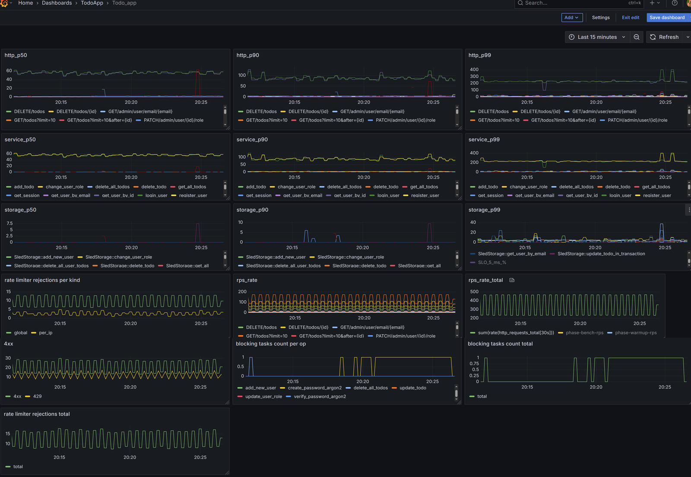
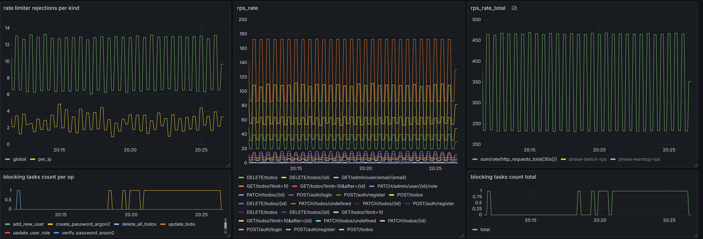

# To-Do Service • Axum | Sled | OpenTelemetry

A compact, production-minded REST service demonstrating:

* Clean three-layer architecture: **Storage → Service → HTTP Handlers**.
* **Service** uses **Storage** though traits → concrete implementation of storage can be replaced
* Available **Storage** impl - embedded key-value storage on **Sled** with **Bincode** encoding.
* **JWT authentication**, role-based authorization, server-side sessions.
* **Full OpenTelemetry instrumentation** via the `opentelemetry` crate
  → traces & metrics exported to **Tempo / Prometheus / Grafana**.
* CI-friendly unit, integration **and** load tests (k6).
* **Docker-first** workflow with hot-reload via `cargo watch`.

---
# Dockerized workflow

    # Spin up observability stack (Tempo, Prometheus, Grafana, OTel-Collector, Todo app)
    docker compose -f compose/docker-compose.observability.yml -p observability up --build -d

    # Spin up todo_app in dev mode: debug build with cargo watch
    docker compose -f compose/docker-compose.dev.yml -p dev up --build -d

---

# Content

1. [Project layout](#1--project-layout)
2. [Http API](#2--http-api-axum-08)
3. [AuthN & AuthZ](#3--authn--authz)
4. [Storage layer](#4--storage-layer--sled--bincode)
5. [Observability Stack](#5--observability-stack)
6. [Configuration & Tuning](#6--configuration--tuning)
7. [Testing matrix and coverage](#7-testing-matrix-and-coverage)
8. [Bench tests](#8-bench-tests)
9. [Rate limiting strategy](#9-rate-limiting-strategy)
10. [Roadmap](#10-roadmap)

## 1  Project Layout

    crate
    ├── src
        ├── storage/ # storage traits, sled storage impl
        ├── service/ # business rules, password hashing/verification, jwt tokens generation
        ├── handlers/ # thin Axum handlers -> Result<_, StatusCode>
        ├── middleware/ # JWT validation, role gate, rate limiters, update http request metric, create tracing span root
        ├── init/ # functions to initialize tracing/metrics providers, storage
        ├── utils/ # app metrics definitions, root span wrapper, blocking tasks gauge wrapper
    ├── bench/ # k6 scripts + docker compose to run k6 load tests
    ├── compose/ # docker compose files to run observability stack and application for development
    ├── config/ # default.toml • production.toml • …
    ├── tests/ # integration tests
    ├── app.rs # assemble axum router with swagger-ui wrapper
    ├── lib.rs # exposes bare minimum public types to use in main.rs and integration tests (under cfg guard)
    ├── main.rs # entry point, setup tokio runtime, flushes tracing/metrics providers, storage


---

## 2  HTTP API (Axum 0.8)

| Route                              | Method               | Auth                  | Description                   |
|------------------------------------|----------------------|-----------------------|-------------------------------|
| `/auth/register`                   | POST                 | –                     | Create user                   |
| `/auth/login`                      | POST                 | –                     | Issue Access + Refresh tokens |
| `/auth/refresh`                    | POST                 | **Session / Refresh** | Rotate tokens                 |
| `/auth/logout`                     | POST                 | **User**              | Invalidate session            |
| `/todos`                           | GET / POST / DELETE  | **User**              | List / create / bulk delete   |
| `/todos/{id}`                      | GET / PATCH / DELETE | **User**              | CRUD single To-Do             |
| `/admin/users`                     | GET                  | **Admin**             | List all users                |
| `/admin/user/{id}` / `…/email/{e}` | GET / DELETE         | **Admin**             | Inspect / remove              |
| `/admin/user/{id}/role`            | PATCH                | **Admin**             | Promote / demote              |
| `/health`                          | GET                  | –                     | Liveness-probe                |

All handlers are annotated with **`#[utoipa::path]`** → Swagger UI is exposed at `/swagger-ui`


---

## 3  AuthN & AuthZ

| Concern        | Implementation |
|----------------|----------------|
| Password hash  | 2 possible impl: **`argon2`** and **`ring::pbkdf2`** |
| Tokens         | **JWT** HS256. 10 min Access, 10 days Refresh (configurable) |
| Sessions       | Server side session, TTL configurable |
| Roles          | `Role::{User, Admin}` checked by `require_role` middleware. |
| Error handling | Invalid/Expired token → `401`; forbidden role → `403`. |

By default argon2 is used with these parameters:
```toml
# excerpt default.toml
[auth.argon2]
memory_cost = 32768
time_cost = 2
parallelism = 1
```
Given parameters were selected based on bench tests run under 30 rps registration load, targeting SLO of 250 ms per hash.
Why 30 rps? 4 hashes per second (argon2 utilizes 1 thread regardless of parallelism parameter) * 8 cpu cores = 32. Rounded to 30.

k6 test details: 1 minutes warmup with 30 rps and 2 minutes bench with 30 rps load.

Results on Intel(R) Core(TM) i7-6820HK CPU * 32 GB RAM (results in each row are averages from 5 runs):

| `m_cost` (MiB) | `t_cost` | p50 (ms) | p90 (ms) | p95 (ms) | p99 (ms) | % > 250 ms  | max run queue len             |
|----------------|----------|----------|----------|----------|----------|-------------|-------------------------------|
| 19             | 1        | 19       |   34     |  43      |    59    |     0       | 0                             |
| 19             | 2        | 31       |   47     |  49      |    69    |     0       | 1                             |
| 19             | 3        | 41       |   65     |  72      |    121   |     0.07    | 6                             |
| 19             | 4        | 66       |   130    |  214     |    444   |     12      | 5                             |
| 32             | 1        | 29       |   47     |  49      |    69    |     0       | 5                             |
| 32             | 2        | 59       |   111    |  144     |    263   |     2.4     | 5 (average from 8, 6, 1, 8, 1)|
| 32             | 3        | 105      |   300    |  360     |    550   |     28      | 35                            |

Compared to weaker settings (`t_cost=1`, `m_cost=19 MiB`), selected configuration (`t_cost=2`, `m_cost = 32 MiB`):
- Improves defense against GPU/ASIC attacks by increasing memory usage
- Preserves latency guarantees (`p95 ≈ 144 ms`, `p99 ≈ 263 ms`)
- Maintains stable load: only ~2.4% of hashes exceed 250 ms
- Keeps blocking task queue shallow (`max queue = 5`)
- Avoids unpredictable latency spikes seen at `t=3` (`p99 > 500 ms`, queue up to 35)

This makes it a balanced default for production scenarios where user-facing latency is critical but password hashes must resist offline brute-force attempts.


Results for pbkdf2 for **10 rps** load:
| `iterations`   | p50 (ms) | p90 (ms) | p95 (ms) | p99 (ms) | % > 250 ms  |
|----------------|----------|----------|----------|----------|-------------|
| 310000         |  180     | 244      |   302    |  456     |    11.1     |


---

## 4  Storage Layer — `sled` + `bincode`

| Aspect                  | Choice | Motivation |
|-------------------------|--------|------------|
| Engine                  | **`sled` 0.34** | Zero-config, embedded LSM tree; crash-safe; single-binary deployment (no external DB for PoC / edge nodes). |
| Serialization           | **`bincode` 2** | Compact (< 1 B overhead per value); zero-alloc; Serde-driven. |
| Key scheme              | `"<prefix>:<uuid>"` | Prefix keeps related keys adjacently on disk → fast range scans for pagination. |
| Separation of stored entities |  Dedicated `user`/`todo`/`session` trees| Storage load spread |
| Durability              | `sled::transaction` + explicit `flush()` on graceful shutdown. | Prevent loosing any data |
| Implementation dependency isolation| Upper `service` layer uses storage via UserStorage/TodoStorage/SessionStorage traits | Easy to change storage impl from `sled` to for ex. `Postgres`

**Only methods with transaction are wrapped into `spawn_blocking`**

k6 benchmarks (1 k rps mixed CRUD) show _P99 ≤ 10 ms_ for single sled call; therefore synchronous I/O stays inside latency SLO and avoids thread-pool context switches.

p99 from 5 minute full bench run (registration + login + crud) for sled single call methods:


p99 from 5 minute full bench run (registration + login + crud) for methods with transactions:


---

## 5  Observability Stack

| Component   | Ports | Purpose |
|-------------|-------|---------|
| **otel-collector** | 4317 | Fan-out OTLP → Tempo (traces) + Prometheus (metrics). |
| **tempo**          | 3200/4317 | Trace backend; compaction retention 1 h. |
| **prometheus**     | 9090      | Metric storage & alert rules. |
| **grafana**        | 3001      | Dashboards |

### Tracing configuration

* Sampling rate: `telemetry.tracing_sampling_rate` - default `0.1`.
* **Spans containing an error are _always_ exported** — middleware sets `sampling.priority = 1`.
* High-cardinality labels (`enduser_id`, `todo_id`, `session_id`, `email` etc) live only on the **root span**; Tempo indexes these labels explicitly to keep search < 100 ms.

```yaml
# excerpt tempo.yaml
storage:
  trace:
    backend: local
    local:
      path: /tmp/tempo/blocks
    wal:
      path: /tmp/tempo/wal
    block:
      version: vParquet4
      parquet_dedicated_columns:
        - name: enduser_id
          type: string
          scope: span
        - name: enduser_email
          type: string
          scope: span
        - name: target_user_id
          type: string
          scope: span
```
Example of trace


There are 4 exported to json dashboards in `/compose/grafana/dashboards` folder which automatically loaded in Grafana when observability stack starts:
1. auth # panels to track performance of password hashing/verifying
2. todo_app # panels to track overall performance of the application with breakdown into handlers/service/storage p_50/p_90/p_99 metrics.
3. k6_bench # metrics exported by k6 during bench testing. It has `phase` variable to be able to separate `warmup` and `bench` phases performance.
4. windows_node_exporter # to track Windows system performance

auth dashboard


todo_app dashboard


windows_node_exporter dashboard


k6_bench


---

## 6  Configuration & Tuning

All settings live in `config/*.toml` and can be overridden with `APP__…` environment variables (double underscores map to dots).

| Section       | Default              | Purpose |
|---------------|----------------------|---------|
| `storage`     | `sled`               | selection of storage implementation and impl parameters|
| `jwt`         | `10min/10days/30days`| JWT access/refresh-token/session TTLs |
| `telemetry`   | -                    | Enables tracing/metrics/stdout_tracing; tracing/metrics endpoints; tracing sampling rate |
| `server`      | `0.0.0.0:3400`       | Application server address |
| `auth`        | `argon2` - default   | Selection of kdf algo (argon2 or pbkdf2); parameters of kdf algo; credentials of admins |
| `rate_limiter`| -                    | limits for endpoints/group of endpoints of 2 kind: global and per_ip |

```toml
# config/default.toml  (excerpt)
[storage]
backend = "sled"

[storage.sled]
path = "/app/sled_data"
# in delete_all we delete items in batches
delete_batch_size = 100

[jwt]
# 10 min
access_token_ttl_sec = 600
# 10 days
refresh_token_ttl_sec = 864000
# 30 days
session_ttl_sec = 2592000

[telemetry]
tracing_endpoint = "http://otel-collector:4317"
metrics_endpoint = "http://otel-collector:4317"
```

---

## 7 Testing matrix and coverage

| Tier                                     | 	Runner / Tooling | Location
|-----------------------------------------|------|----------|
|`Unit`                                   |cargo test | `#[cfg(test)]` modules |
|`Integration`                            |Tokio + Axum|`tests/*.rs` (spins full app)|
|`Load`                                   |k6 + Docker|`bench/scripts/`|

Code coverage with existing tests


---

## 8 Bench tests

Tested on Intel(R) Core(TM) i7-6820HK CPU * 32 GB RAM machine.

bench folder layout

    crate
    ├── bench
      ├── bench_scripts/ # k6 test scripts
      ├── gentokens/     # tiny rust project to generate jwt tokens
      ├── build.sh       # script to build docker containers for bench testing
      ├── run.sh         # main script to run bench tests
      ├── docker-compose.bench.yml # containers for bench testing: gentokens, todo_app in release build, k6
      ├── Dockerfile_bench # dockerfile to build todo_app in release mode
      ├── Dockerfile_gentokens # dockerfile to build gentokens

tests:
* `registration.js` - load tests for `/auth/register` endpoint
* `login.js` - load tests for `/auth/login` endpoint. These tests use tokens generated by gentokens
* `promote_user.js` - load tests for `/admin/user/{id}/role` endpoint. These tests use user login data generated by gentokens
* `crud.js` - load tests for `/todos` endpoints. These tests use tokens generated by gentokens
   CRUD scenarios:
    - create todo
    - delete todo (get users todos, delete 1st one; if user doesn't have todos yet, create one and delete it)
    - update todo (get users todos, update 1st one; if user doesn't have todos yet, create one and update it)
    - get all user todos
    - delete all user todos
* `full.js` - all scenarios together: registration, login, promote, crud.

Each test includes a warm-up phase followed by a benchmark phase to ensure stable metrics.

# Bench workflow:

      # run scripts from bench folder
      cd bench

      # build containers: todo_app in release mode, gentokens app, k6
      ./build.sh

      # run bench test for registration
      # --kdf=argon2 - password hashing function - argon2
      # --ips=20 - test script will send requests from 20 random client ips
      ./run.sh --bench_test=registration --kdf=argon2 --ips=20

      # run bench test for registration
      # --kdf=pbkdf2 - password hashing function - pbkdf2
      # --iterations=310000 - iterations to run hash function by pbkdf2
      # --ips=20 - test script will send requests from 20 random client ips
      ./run.sh --bench_test=registration --kdf=pbkdf2 --iterations=310000 --ips=20

      # run bench test for login
      # --kdf=argon2 - password hashing function - argon2
      # --ips=20 - test script will send requests from 20 random client ips
      # --tokens=50 - gentokens app will register 50 users and save user data (email, password, token) into known file
      ./run.sh --bench_test=login --kdf=argon2 --tokens=50 --ips=20

      # run bench test for crud
      # --kdf=argon2 - password hashing function - argon2
      # --ips=100 - test script will send requests from 100 random client ips
      # --tokens=300 - gentokens app will register 300 users and save user data (email, password, token) into known file
      ./run.sh --bench_test=crud --kdf=argon2 --tokens=300 --ips=100

      # run full bench test
      # --kdf=argon2 - password hashing function - argon2
      # --ips=50 - test script will send requests from 50 random client ips
      # --tokens=300 - gentokens app will register 300 users and save user data (email, password, token) into known file
      ./run.sh --bench_test=full --kdf=argon2 --tokens=300 --ips=50

run.sh parameters:
  - --app_config # config file to use, `default - bench`
  - --bench_test # one of: registration, login, crud, full, promote
  - --kdf # password hashing function: argon2 or pbkdf2 (pbkdf2 needs also --iterations parameter, default is 1000)
  - --iterations # parameter to tune pbkdf2 password hashing function
  - --ips # number of IP addresses script will send requests from. This is needed to prevent rate limeter from rejection requests based on per_ip limits. This parameter also needs config option `rate_limiter.x_forwarded_for = true`. Which is set by default in `bench.toml` config file. Script sets random ip in `x_forwarded_for` header, and app reads client ip from this header (enabled only in bench.toml with rate_limiter.x_forwarded_for = true). This is done only for bench testing to simulate load from different clients.
  - --tokens # number of tokens to pre-generate before running tests. `gentokens` app writes token into `/tokens/tokens.json` file. Test scripts read tokens from this file.

Bench testing emits tracing/metrics. By default tracing sampling rate is 0.1. Increasing it to more substential value will impact performance.
There is additional dashboard for k6 metrics. It shows picture of app performance from k6 perspective. Because scenarios in tests are marked with tags (`warmup`/`bench`) it's possible to see performance for different phases. Dashboard has `phase` variable.


---

## 9. Rate limiting strategy

The application implements a fail-fast rate limiter powered by the `governor` crate. It works at two levels:
- Global limiters restrict the total request rate for each endpoint group
- Per-IP limiters enforce fairness and isolate noisy clients

All excess requests are rejected immediately, with no buffering or queuing, returning HTTP `429 Too Many Requests`.

### How the limits were calculated:

Rate limits are based on measured performance from isolated k6 benchmarks:
1. Each endpoint group was tested separately to determine its maximum sustainable p99 latency.
    - registration and login were capped at 250ms p99, stable up to 30 rps combined
    - crud operations showed 5ms p99 up to ~400 rps (without concurrent load)

2. CPU budget planning:
    - Target: ≤ 80% system CPU usage
    - Argon2 operations at 18 rps (login + registration) consume ≈ 4.5 cores
    - Remaining ~1.9 cores allocated to crud and admin → yields ≈ 380 rps for writes/reads

3. Under real-world mixed load, storage p99 spiked to 60–75 ms at times. In response, crud limits were split into light vs heavy categories to better protect latency-sensitive operations.


### Light vs Heavy CRUD separation

  |Type	|Endpoints	|Global Limit	|Per-IP Limit|
  |-----|-----------|-------------|------------|
  |Light CRUD|	get_todo, get_all_todos, delete_todo|	320 rps|	15 rps|
  |Heavy CRUD|	update_todo, delete_all_todos	|60 rps	|10 rps|

  This design protects the blocking thread pool and sled engine from overload, while allowing light, frequent operations to proceed smoothly.

### Benchmark strategy

Benchmarks are intentionally run with 10–15% higher RPS than the configured limits, simulating:
  - real-world overuse by aggressive clients
  - behavior behind a load balancer or edge throttle
  - validation of graceful failure (fail-fast)

All 429 rejections are observable in metrics and traces (e.g. Prometheus, Tempo), providing full visibility into overload conditions.

### SLO Compliance

A 20-minute benchmark with full mixed load confirmed that the system meets its latency SLO target:
  - 99th percentile of storage operations under 5 ms (SLO compliance consistently ≥ 98.8%)
  - 99th percentile of password hashing/verification under 250 ms
  - All overload conditions are handled via fail-fast limiting

This confirms that the system behaves predictably under stress, and the rate limits isolate heavy workloads without degrading core latency.

Panel with p99 for storage operations and SLO < 5ms line.


Panels with SLO < 250ms lines for hashing and verifying password.


Panel with max run queue length.


k6 output from running mixed load:
```
k6  |      ✗ delete_all_todos
k6  |       ↳  99% — ✓ 39380 / ✗ 221
k6  |      ✗ get_todo
k6  |       ↳  96% — ✓ 96554 / ✗ 3048
k6  |      ✗ created
k6  |       ↳  83% — ✓ 132950 / ✗ 25844
k6  |      ✗ fallback deleted
k6  |       ↳  59% — ✓ 22662 / ✗ 15445
k6  |      ✗ register 201 or 409
k6  |       ↳  87% — ✓ 10539 / ✗ 1462
k6  |      ✗ updated
k6  |       ↳  68% — ✓ 15173 / ✗ 7013
k6  |      ✗ get_todos
k6  |       ↳  99% — ✓ 59945 / ✗ 222
k6  |      ✓ promote_user
k6  |      ✗ deleted
k6  |       ↳  98% — ✓ 35007 / ✗ 569
k6  |      ✗ login 200
k6  |       ↳  99% — ✓ 11955 / ✗ 46
k6  |      ✗ login token exists
k6  |       ↳  99% — ✓ 11955 / ✗ 46
k6  |
k6  |      █ setup
k6  |
k6  |        ✓ login 200
k6  |        ✓ login token exists
k6  |
k6  |      checks.....................: 89.26% ✓ 448123     ✗ 53916
k6  |      data_received..............: 86 MB  65 kB/s
k6  |      data_sent..................: 232 MB 176 kB/s
k6  |      http_req_blocked...........: avg=7.06µs  min=1.1µs      max=67.24ms  p(90)=7.8µs   p(95)=12.1µs   p(99)=23.8µs
k6  |      http_req_connecting........: avg=1.8µs   min=0s         max=67.15ms  p(90)=0s      p(95)=0s       p(99)=0s
k6  |      http_req_duration..........: avg=4.27ms  min=-933549ns  max=397.86ms p(90)=2.77ms  p(95)=16.43ms  p(99)=67.18ms
k6  |      http_req_failed............: 10.99% ✓ 53870      ✗ 436167
k6  |      http_req_receiving.........: avg=81.49µs min=8.7µs      max=28.73ms  p(90)=127.5µs p(95)=153.81µs p(99)=254.51µs
k6  |      http_req_sending...........: avg=38.56µs min=-1909708ns max=33.17ms  p(90)=67.4µs  p(95)=83.1µs   p(99)=143µs
k6  |      http_req_tls_handshaking...: avg=0s      min=0s         max=0s       p(90)=0s      p(95)=0s       p(99)=0s
k6  |      http_req_waiting...........: avg=4.15ms  min=0s         max=396.54ms p(90)=2.6ms   p(95)=16.17ms  p(99)=67.04ms
k6  |      http_reqs..................: 490037 371.224953/s
k6  |      iteration_duration.........: avg=6.23ms  min=348.12µs   max=398.44ms p(90)=6.44ms  p(95)=48.98ms  p(99)=73.89ms
k6  |      iterations.................: 355209 269.086711/s
k6  |      vus........................: 1      min=0        max=9
k6  |      vus_max....................: 410    min=410      max=410
k6  |
k6  |
k6  | running (22m00.1s), 0000/0410 VUs, 355209 complete and 0 interrupted iterations
k6  | warm_up                   ✓ [ 100% ] 000/100 VUs  2m0s   500.00 iters/s
k6  | warm_up_delete_all_todos  ✓ [ 100% ] 000/030 VUs  2m0s   30.00 iters/s
k6  | warm_up_reg               ✓ [ 100% ] 000/010 VUs  2m0s   20.00 iters/s
k6  | warm_up_update_todo       ✓ [ 100% ] 000/030 VUs  2m0s   30.00 iters/s
k6  | create_todo               ✓ [ 100% ] 000/050 VUs  20m0s  50.00 iters/s
k6  | delete_all_todos          ✓ [ 100% ] 000/030 VUs  20m0s  30.00 iters/s
k6  | delete_todo_with_fallback ✓ [ 100% ] 000/050 VUs  20m0s  50.00 iters/s
k6  | get_all_todos             ✓ [ 100% ] 000/050 VUs  20m0s  50.00 iters/s
k6  | login                     ✓ [ 100% ] 000/010 VUs  20m0s  10.00 iters/s
k6  | promote_user              ✓ [ 100% ] 000/010 VUs  20m0s  10.00 iters/s
k6  | registration              ✓ [ 100% ] 000/010 VUs  20m0s  8.00 iters/s
k6  | update_todo               ✓ [ 100% ] 000/030 VUs  20m0s  30.00 iters/s

```
Panels with global and per_ip rate limiter rejections and stable rps


---

## 10. Roadmap

    1. Postgres adapter implementing the same TodoStorage / UserStorage / SessionStorage traits.

    2. CI: fmt + clippy -D warnings + cargo audit + test → Docker Buildx → GHCR.

    3. Signed release binaries; JWT secret pulled from Vault on start-up.

    4. Additional Grafana dashboards (capacity, WAL growth) and Alertmanager rules.